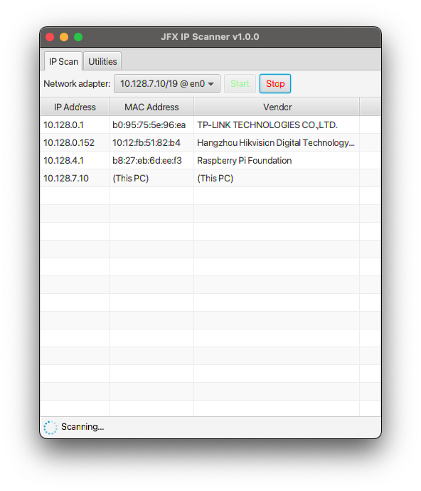

JFX IP Scanner
==============

A simple IP scanner powered by JavaFX and Kotlin.



## Download

Installer packages are available at [releases page](https://github.com/mikan/jfx-ip-scanner/releases).

## Development

### Prerequisites

- JDK 15 or higher

### Local run

```
./gradlew run
```

### Packaging

```
./gradlew jpackage
```

### Vendor database

The vendor database is downloaded from the following URL:

```
http://standards-oui.ieee.org/oui/oui.csv
```

### External IP checker

The external IP checker uses following URL:

```
https://checkip.amazonaws.com/
```

## License

[Apache License 2.0](LICENSE)

## Author

- [mikan](https://github.com/mikan)
